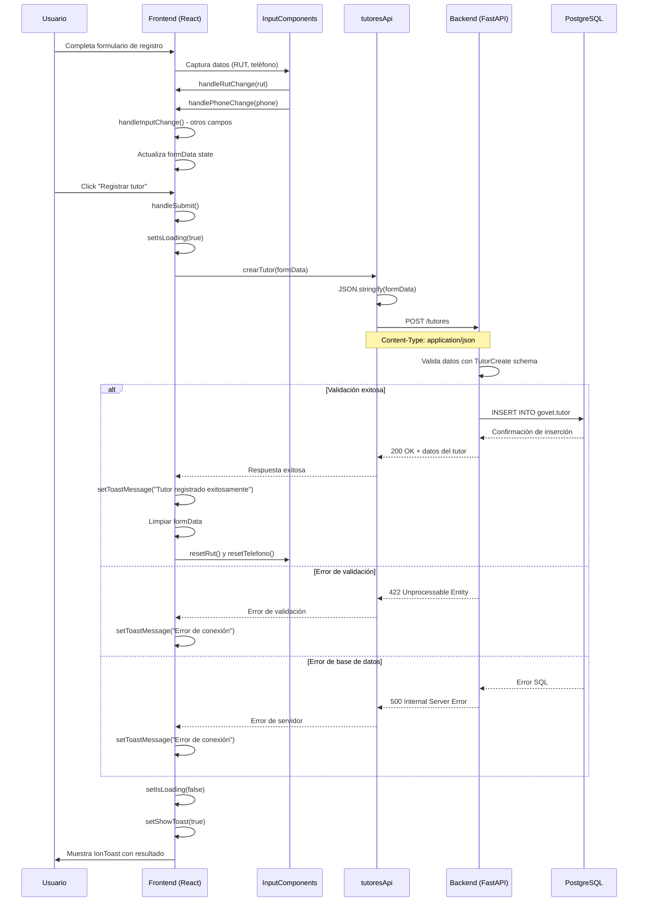

```mermaid
sequenceDiagram
    participant U as Usuario
    participant F as Frontend (React)
    participant IC as InputComponents
    participant API as tutoresApi
    participant B as Backend (FastAPI)
    participant DB as PostgreSQL

    U->>F: Completa formulario de registro
    F->>IC: Captura datos (RUT, teléfono)
    IC->>F: handleRutChange(rut)
    IC->>F: handlePhoneChange(phone)
    F->>F: handleInputChange() - otros campos
    F->>F: Actualiza formData state
    
    U->>F: Click "Registrar tutor"
    F->>F: handleSubmit()
    F->>F: setIsLoading(true)
    
    F->>API: crearTutor(formData)
    API->>API: JSON.stringify(formData)
    API->>B: POST /tutores
    Note over API,B: Content-Type: application/json
    
    B->>B: Valida datos con TutorCreate schema
    alt Validación exitosa
        B->>DB: INSERT INTO govet.tutor
        DB-->>B: Confirmación de inserción
        B-->>API: 200 OK + datos del tutor
        API-->>F: Respuesta exitosa
        F->>F: setToastMessage("Tutor registrado exitosamente")
        F->>F: Limpiar formData
        F->>IC: resetRut() y resetTelefono()
    else Error de validación
        B-->>API: 422 Unprocessable Entity
        API-->>F: Error de validación
        F->>F: setToastMessage("Error de conexión")
    else Error de base de datos
        DB-->>B: Error SQL
        B-->>API: 500 Internal Server Error
        API-->>F: Error de servidor
        F->>F: setToastMessage("Error de conexión")
    end
    
    F->>F: setIsLoading(false)
    F->>F: setShowToast(true)
    F->>U: Muestra IonToast con resultado
```